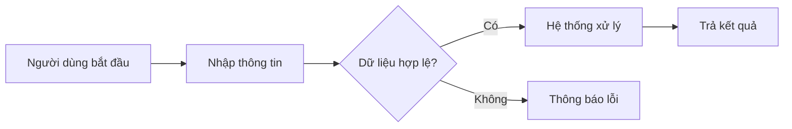

# MẪU NỘI DUNG POWERPOINT ĐỒ ÁN

> Tài liệu Markdown này được chuyển đổi từ file mẫu `MAUPPT.pptx`.
> Mục đích: dùng làm khung để AI đọc cùng mã nguồn/tài liệu dự án và tạo nội dung thuyết trình theo đúng cấu trúc mẫu.

## 1. Nguyên tắc sử dụng mẫu

- Giữ đúng thứ tự **15 slide**, mỗi mục trong Markdown tương ứng với một slide.
- Nội dung phải được lấy từ tài liệu, mã nguồn, cơ sở dữ liệu, hình ảnh và kết quả thực tế của dự án.
- Không tự tạo số liệu, chức năng, công nghệ hoặc kết quả chưa có bằng chứng trong project.
- Khi thiếu dữ liệu, ghi rõ: `[CẦN BỔ SUNG: nội dung còn thiếu]`.
- Nội dung trên slide cần ngắn gọn, ưu tiên gạch đầu dòng, bảng, sơ đồ và hình minh họa.
- Thuật ngữ kỹ thuật, tên chức năng, tên công nghệ và tên module phải giữ đúng như trong project.
- Với sơ đồ, có thể dùng Mermaid hoặc ghi rõ vị trí cần chèn ảnh/sơ đồ.

> **Lưu ý về mẫu gốc:** Slide mục lục có phần “Cài đặt thực nghiệm”, nhưng mẫu không có một slide riêng mang tên này. Khi tạo nội dung theo dự án, cần tích hợp phần cài đặt/thực nghiệm vào các slide 9–11 hoặc phần kết quả, trừ khi người dùng yêu cầu thêm slide.

---

## 2. Cấu trúc nội dung 15 slide

## Slide 01 — Trang bìa

- **Trường:** `[Tên trường]`
- **Đồ án môn học:** `[Tên học phần/đồ án]`
- **Ngành:** `[Tên ngành/chuyên ngành]`
- **Đề tài:** `[Tên đầy đủ của dự án]`
- **Sinh viên thực hiện:** `[Họ tên – MSSV – Lớp]`
- **Giảng viên hướng dẫn:** `[Nếu có]`

## Slide 02 — Các phần cần trình bày

1. Tổng quan đề tài
2. Phân tích và thiết kế
3. Cài đặt, thực nghiệm và minh họa hệ thống
4. Kết luận
5. Hướng phát triển

## Slide 03 — Tổng quan đề tài

Trình bày ngắn gọn bốn nội dung:

- Mục tiêu đề tài
- Nội dung/phạm vi đề tài
- Công nghệ thực hiện
- Phần mềm và công cụ sử dụng

## Slide 04 — Mục tiêu đề tài

- Vấn đề thực tế mà dự án cần giải quyết.
- Mục tiêu tổng quát.
- Các mục tiêu cụ thể.
- Đối tượng sử dụng hoặc đối tượng hưởng lợi.
- Tiêu chí để đánh giá dự án hoàn thành.

## Slide 05 — Nội dung đề tài

- Phạm vi của hệ thống.
- Các nghiệp vụ chính.
- Các nhóm người dùng.
- Dữ liệu đầu vào và kết quả đầu ra.
- Những nội dung không thuộc phạm vi dự án.

## Slide 06 — Công nghệ thực hiện

Liệt kê đúng các công nghệ có trong project, có thể trình bày bằng bảng:

| Nhóm | Công nghệ | Vai trò trong dự án |
|---|---|---|
| Frontend | `[Tên công nghệ]` | `[Vai trò]` |
| Backend | `[Tên công nghệ]` | `[Vai trò]` |
| Database | `[Tên CSDL]` | `[Vai trò]` |
| API/Dịch vụ | `[Tên dịch vụ]` | `[Vai trò]` |
| Triển khai | `[Nền tảng]` | `[Vai trò]` |

## Slide 07 — Phần mềm và công cụ sử dụng

- IDE hoặc trình soạn thảo mã nguồn.
- Công cụ thiết kế giao diện.
- Công cụ quản lý cơ sở dữ liệu.
- Công cụ kiểm thử API.
- Công cụ quản lý phiên bản.
- Công cụ triển khai, mô phỏng hoặc chạy thử.

## Slide 08 — Phân tích và thiết kế

Giới thiệu ba phần chính:

1. Quy trình hoạt động của hệ thống.
2. Các chức năng hoặc phân hệ.
3. Use case và các tác nhân sử dụng hệ thống.

## Slide 09 — Quy trình hoạt động

- Mô tả quy trình nghiệp vụ từ đầu đến cuối.
- Xác định dữ liệu đầu vào, các bước xử lý và kết quả đầu ra.
- Nêu các điều kiện rẽ nhánh hoặc trường hợp lỗi quan trọng.
- Chèn sơ đồ luồng hoặc Mermaid flowchart nếu có đủ dữ liệu.

Ví dụ khung Mermaid:



## Slide 10 — Các chức năng hoặc phân hệ

Có thể trình bày theo bảng:

| STT | Chức năng/phân hệ | Người sử dụng | Mô tả ngắn |
|---:|---|---|---|
| 1 | `[Tên chức năng]` | `[Vai trò]` | `[Mô tả]` |
| 2 | `[Tên chức năng]` | `[Vai trò]` | `[Mô tả]` |
| 3 | `[Tên chức năng]` | `[Vai trò]` | `[Mô tả]` |

Yêu cầu:

- Nhóm các chức năng theo module hoặc vai trò người dùng.
- Chỉ ghi các chức năng thực sự có trong project.
- Đánh dấu chức năng đã hoàn thiện, đang thử nghiệm hoặc chưa hoàn thiện nếu có bằng chứng.

## Slide 11 — Use case và cài đặt thực nghiệm

- Xác định các tác nhân của hệ thống.
- Liệt kê use case chính của từng tác nhân.
- Nêu mối quan hệ giữa các use case quan trọng.
- Chèn sơ đồ use case nếu project có tài liệu hoặc có thể suy ra chắc chắn từ mã nguồn.
- Bổ sung hình ảnh giao diện, kết quả chạy thử hoặc các bước kiểm thử tiêu biểu.
- Ghi chú vị trí ảnh theo dạng: `[CHÈN ẢNH: tên màn hình hoặc kết quả thực nghiệm]`.

Ví dụ khung:

| Tác nhân | Use case chính |
|---|---|
| `[Vai trò 1]` | `[Các chức năng]` |
| `[Vai trò 2]` | `[Các chức năng]` |

## Slide 12 — Kết luận

Tóm tắt hai nội dung:

- Những kết quả đã đạt được.
- Những hạn chế còn tồn tại.

Không lặp lại toàn bộ nội dung các slide trước.

## Slide 13 — Những kết quả đạt được

- Các chức năng đã hoàn thành.
- Kết quả kỹ thuật hoặc nghiệp vụ.
- Kết quả kiểm thử/thực nghiệm.
- Khả năng ứng dụng thực tế.
- Sản phẩm bàn giao: mã nguồn, cơ sở dữ liệu, tài liệu, bản triển khai hoặc video demo.

## Slide 14 — Hạn chế

- Chức năng chưa hoàn thiện.
- Hạn chế về dữ liệu, bảo mật, hiệu năng hoặc trải nghiệm người dùng.
- Hạn chế về thời gian, nhân lực, thiết bị hoặc môi trường triển khai.
- Các trường hợp chưa được kiểm thử đầy đủ.

Phải phân biệt rõ giữa **hạn chế đã được xác nhận** và **rủi ro có thể xảy ra**.

## Slide 15 — Hướng phát triển

- Hoàn thiện các chức năng còn thiếu.
- Tối ưu hiệu năng và giao diện.
- Tăng cường bảo mật và phân quyền.
- Mở rộng nền tảng, thiết bị hoặc nhóm người dùng.
- Tích hợp công nghệ/dịch vụ mới khi phù hợp.
- Xây dựng kế hoạch triển khai thực tế.

---

## 3. Định dạng file đầu ra AI phải tạo

AI cần tạo một file Markdown có cấu trúc:

```markdown
# NỘI DUNG THUYẾT TRÌNH: [TÊN DỰ ÁN]

## Slide 01 — [Tiêu đề]
[Nội dung]

## Slide 02 — [Tiêu đề]
[Nội dung]

...

## Slide 15 — [Tiêu đề]
[Nội dung]

## Phụ lục nguồn dữ liệu
- [Tên file hoặc đường dẫn trong project]: nội dung đã sử dụng
```

### Quy tắc trình bày

- Mỗi slide nên có khoảng 3–6 ý chính.
- Mỗi gạch đầu dòng ưu tiên không quá 25 từ.
- Không viết thành đoạn văn dài nếu có thể chuyển thành gạch đầu dòng hoặc bảng.
- Nêu số liệu cụ thể khi project có số liệu đáng tin cậy.
- Mỗi nhận định kỹ thuật quan trọng cần ghi nguồn file hoặc vị trí trong project.
- Hình ảnh chưa thể nhúng trực tiếp phải ghi placeholder rõ ràng.
- Kết quả cuối cùng chỉ chứa nội dung Markdown, không kèm lời giải thích ngoài tài liệu.

---

# 4. PROMPT DÙNG ĐỂ YÊU CẦU AI ĐỌC MẪU VÀ PROJECT

Sao chép nguyên prompt dưới đây và gửi kèm file Markdown mẫu này cùng toàn bộ project:

```text
Bạn là chuyên gia phân tích dự án phần mềm và biên soạn nội dung thuyết trình đồ án.

Tôi cung cấp cho bạn:
1. File mẫu Markdown: MAUPPT_MAU_VA_PROMPT.md.
2. Toàn bộ project, gồm mã nguồn, README, tài liệu, cấu hình, cơ sở dữ liệu, hình ảnh và các file liên quan.

NHIỆM VỤ:
- Đọc toàn bộ file mẫu trước để hiểu cấu trúc 15 slide.
- Sau đó đọc và phân tích toàn bộ project.
- Ưu tiên kiểm tra README, package.json/requirements.txt/pom.xml hoặc file cấu hình tương đương, cấu trúc thư mục, mã nguồn chính, database/schema, API, giao diện, tài liệu và ảnh kết quả.
- Xác định chính xác: tên dự án, mục tiêu, phạm vi, người dùng, quy trình, chức năng, kiến trúc, công nghệ, phần mềm sử dụng, use case, kết quả thực nghiệm, kết quả đạt được, hạn chế và hướng phát triển.
- Tạo file Markdown mới có tên: NOI_DUNG_PPT_[TEN_DU_AN].md.
- File đầu ra phải có đúng 15 mục từ “Slide 01” đến “Slide 15”, tương ứng 1–1 với mẫu.
- Nội dung phải được viết theo đúng dự án, không sao chép các câu placeholder trong mẫu.

YÊU CẦU BẮT BUỘC:
1. Không tự bịa chức năng, công nghệ, số liệu, kết quả kiểm thử hoặc thông tin người thực hiện.
2. Thông tin chưa tìm thấy phải ghi: [CẦN BỔ SUNG: ...].
3. Chỉ kết luận một chức năng đã hoàn thành khi có bằng chứng trong mã nguồn, giao diện, tài liệu hoặc kết quả chạy thử.
4. Phân biệt rõ:
   - Chức năng đã hoàn thiện.
   - Chức năng đang thử nghiệm.
   - Chức năng dự kiến/hướng phát triển.
5. Tên công nghệ, tên module, tên API, tên bảng dữ liệu và thuật ngữ kỹ thuật phải giữ đúng theo project.
6. Mỗi slide trình bày ngắn gọn, ưu tiên 3–6 gạch đầu dòng, bảng hoặc sơ đồ.
7. Khi phù hợp, sử dụng Mermaid cho quy trình hoặc kiến trúc; mã Mermaid phải hợp lệ.
8. Slide 11 cần kết hợp use case với bằng chứng cài đặt/thực nghiệm vì mẫu gốc không có slide riêng cho “Cài đặt thực nghiệm”.
9. Với ảnh giao diện hoặc ảnh kết quả, ghi placeholder theo định dạng:
   [CHÈN ẢNH: mô tả ảnh — nguồn: đường_dẫn_file]
10. Cuối file phải có mục “Phụ lục nguồn dữ liệu”, liệt kê các file trong project đã dùng để xây dựng nội dung.
11. Không xuất nội dung ngoài Markdown và không giải thích quá trình suy luận.

TRƯỚC KHI VIẾT:
- Lập danh sách thông tin đã xác minh được từ project.
- Phát hiện các thông tin còn thiếu hoặc mâu thuẫn.
- Tự chọn cách diễn đạt phù hợp với một bài thuyết trình đồ án trang trọng, ngắn gọn và dễ trình chiếu.

ĐẦU RA:
Chỉ trả về toàn bộ nội dung hoàn chỉnh của file NOI_DUNG_PPT_[TEN_DU_AN].md.
```

---

## 5. Prompt ngắn gọn

```text
Đọc file MAUPPT_MAU_VA_PROMPT.md và toàn bộ project tôi gửi. Hãy phân tích dữ liệu thực tế trong project rồi tạo file NOI_DUNG_PPT_[TEN_DU_AN].md theo đúng 15 slide của mẫu. Không bịa thông tin; phần thiếu ghi [CẦN BỔ SUNG]. Giữ đúng tên công nghệ, chức năng và module. Mỗi slide trình bày ngắn gọn bằng gạch đầu dòng, bảng hoặc Mermaid. Slide 11 kết hợp use case và kết quả cài đặt/thực nghiệm. Cuối file liệt kê các file nguồn đã sử dụng. Chỉ xuất nội dung Markdown hoàn chỉnh.
```
