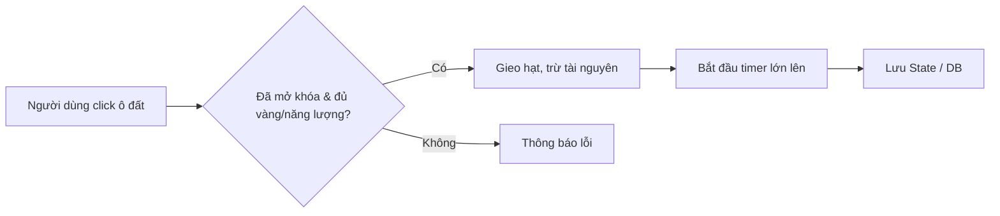

# NỘI DUNG THUYẾT TRÌNH: HAPPY FARM

## Slide 01 — Trang bìa

- **Trường:** Cao Đẳng Công Nghệ Thông Tin
- **Đồ án môn học:** JavaScript
- **Ngành:** Công Nghệ Thông Tin - Điện Tử
- **Đề tài:** Xây dựng Web Game Happy Farm
- **Sinh viên thực hiện:** Trần Văn Minh Chí - Hồ Gia Huy
- **Giảng viên hướng dẫn:** Trương Châu Long

## Slide 02 — Các phần cần trình bày

1. Tổng quan đề tài
2. Phân tích và thiết kế
3. Cài đặt, thực nghiệm và minh họa hệ thống
4. Kết luận
5. Hướng phát triển

## Slide 03 — Tổng quan đề tài

- **Mục tiêu đề tài:** Xây dựng một game nông trại (quản lý tài nguyên) chạy trên trình duyệt.
- **Nội dung/phạm vi đề tài:** Gameplay cốt lõi (trồng trọt, thu hoạch, thú cưng), hệ thống quản trị admin và API backend.
- **Công nghệ thực hiện:** HTML5, CSS3, JS ES Modules, Canvas 2D, Node.js, Express, MySQL.
- **Phần mềm và công cụ sử dụng:** Vite, Node.js.

## Slide 04 — Mục tiêu đề tài

- **Vấn đề thực tế:** Đáp ứng nhu cầu giải trí nhẹ nhàng qua trình duyệt mà không cần cài đặt phần mềm nặng.
- **Mục tiêu tổng quát:** Hoàn thiện game nông trại từ frontend (giao diện, logic game) đến backend (lưu trữ, xác thực).
- **Các mục tiêu cụ thể:** Tích hợp hệ thống năng lượng, kinh nghiệm (XP), cửa hàng, bảng xếp hạng và trang quản trị (Admin).
- **Đối tượng sử dụng:** Người chơi game trên nền tảng web và quản trị viên.
- **Tiêu chí để đánh giá dự án hoàn thành:** Trò chơi hoạt động mượt mà, lưu trữ dữ liệu chính xác và admin có thể quản lý được hệ thống.

## Slide 05 — Nội dung đề tài

- **Phạm vi của hệ thống:** Web game cho người chơi và Dashboard cho Admin.
- **Các nghiệp vụ chính:** Trồng trọt, thu hoạch, mua/bán nông sản, quản lý tài khoản, quản lý cấu hình game.
- **Các nhóm người dùng:** Người chơi (Player), Quản trị viên (Admin).
- **Dữ liệu đầu vào:** Thao tác tương tác (click, kéo thả) của người chơi.
- **Dữ liệu đầu ra:** Trạng thái trang trại được cập nhật real-time trên Canvas và lưu vào DB.

## Slide 06 — Công nghệ thực hiện

| Nhóm | Công nghệ | Vai trò trong dự án |
|---|---|---|
| Frontend | HTML5, CSS3, JS ES Modules | Khung DOM, giao diện, logic game client-side |
| Đồ họa/Âm thanh | Canvas 2D, Web Audio API | Vẽ sprite, hoạt ảnh và phát âm thanh |
| Backend | Node.js, Express | Cung cấp RESTful API |
| Database | MySQL | Lưu trữ dữ liệu người dùng, nông trại, cửa hàng |
| Build Tool | Vite | Dev server và build production |

## Slide 07 — Phần mềm và công cụ sử dụng

- **Môi trường chạy:** Node.js
- **Đóng gói & Chạy thử:** Vite
- **Xử lý đồ họa:** Jimp (script hỗ trợ tách sprite)
- **Công cụ quản lý CSDL:** [CẦN BỔ SUNG: phpMyAdmin, DBeaver, v.v.]
- **IDE:** [CẦN BỔ SUNG: VSCode, WebStorm, v.v.]

## Slide 08 — Phân tích và thiết kế

1. Quy trình hoạt động của hệ thống (Gameplay loop và API flow).
2. Các chức năng hoặc phân hệ (Game logic, Admin Dashboard).
3. Use case và các tác nhân sử dụng hệ thống.

## Slide 09 — Quy trình hoạt động

- Mô tả: Khi người chơi tương tác với ô đất trống, hệ thống kiểm tra năng lượng, nếu đủ sẽ gieo hạt, bắt đầu đếm thời gian phát triển và lưu trạng thái.

## Slide 10 — Các chức năng hoặc phân hệ

| STT | Chức năng/phân hệ | Người sử dụng | Mô tả ngắn |
|---:|---|---|---|
| 1 | Gameplay cốt lõi | Player | Trồng cây, bón phân, thu hoạch nông sản |
| 2 | Cửa hàng & Kho đồ | Player | Mua hạt giống/phân bón, bán sản phẩm |
| 3 | Chế độ thiết kế | Player | Kéo thả bố cục nhà, chuồng, đường đất |
| 4 | Nhiệm vụ & Xếp hạng | Player | Làm nhiệm vụ giao hàng, đua top tuần |
| 5 | Quản lý hệ thống | Admin | Quản lý người chơi, vật nuôi, cây trồng, sự kiện |

*Ghi chú: Toàn bộ chức năng trên đã được hoàn thiện trong project.*

## Slide 11 — Use case và cài đặt thực nghiệm

| Tác nhân | Use case chính |
|---|---|
| Người chơi | Chơi game (trồng trọt, thu hoạch), Mua bán, Chỉnh sửa trang trại |
| Admin | Đăng nhập quản trị, Cấu hình cửa hàng, Quản lý người chơi/dữ liệu |

- **Bằng chứng cài đặt thực nghiệm:** Hệ thống render mượt mà bằng Canvas, trang Admin truy xuất dữ liệu từ DB (thông qua API `/admin`).
- [CHÈN ẢNH: Giao diện trang trại chính — nguồn: game_screenshot.png]
- [CHÈN ẢNH: Giao diện cửa hàng — nguồn: shop_opened.png]
- [CHÈN ẢNH: Giao diện Admin — nguồn: Dữ liệu từ file admin.html]

## Slide 12 — Kết luận

- **Những kết quả đã đạt được:** Hoàn thành một Web Game hoàn chỉnh với đầy đủ các logic phức tạp về xử lý thời gian, Canvas sprite và cơ sở dữ liệu.
- **Những hạn chế còn tồn tại:** Có rủi ro về thao túng dữ liệu client, cần đồng bộ chặt chẽ hơn với hệ thống backend ở mọi thao tác.

## Slide 13 — Những kết quả đạt được

- Hoàn thiện xử lý hoạt ảnh nhân vật (Farmer.js, Animation.js) và logic ô đất (FarmTile.js).
- Cơ sở dữ liệu thiết kế chi tiết (21 bảng) bao gồm hệ thống người dùng, cửa hàng, giao hàng và thống kê.
- Xây dựng thành công Dashboard Admin quản lý toàn bộ cấu hình game mà không cần can thiệp mã nguồn.
- Sản phẩm bàn giao: Mã nguồn frontend, backend (Node.js), file SQL schema và tài liệu README.

## Slide 14 — Hạn chế

- **Dữ liệu cục bộ:** Một số tiến trình vẫn dựa vào `localStorage` (như file `localFallback.js`), dễ bị người chơi dùng trình duyệt chỉnh sửa nếu backend không kiểm tra kỹ.
- **Chưa có Unit Test toàn diện:** Thư mục tests/ đã khởi tạo nhưng chưa bao phủ hết các tình huống gameplay phức tạp.
- Cần mở rộng hệ sinh thái các loại cây trồng và vật nuôi để tăng tính đa dạng.

## Slide 15 — Hướng phát triển

- Chuyển đổi 100% logic xác thực (validation) lên backend để chống gian lận.
- Mở rộng gameplay: thêm chức năng kết bạn, thăm trang trại người khác (Social feature).
- Thêm chức năng chế biến nông sản (Nhà máy, Bếp nấu ăn).
- Cải thiện trải nghiệm âm thanh bằng các bản nhạc nền đa dạng hơn.

## Phụ lục nguồn dữ liệu
- `README.md`: Nguồn dữ liệu về gameplay, công nghệ, cấu trúc thư mục.
- `package.json`: Thông tin về các thư viện backend (Express, MySQL, bcryptjs) và công cụ build (Vite).
- `server/schema.sql`: Cấu trúc cơ sở dữ liệu thực tế (bảng users, farms, shop_products, v.v.).
- `admin.html`: Giao diện và các module quản lý dành cho Admin.
- Hình ảnh `game_screenshot.png`, `shop_opened.png`: Bằng chứng giao diện thực tế.
