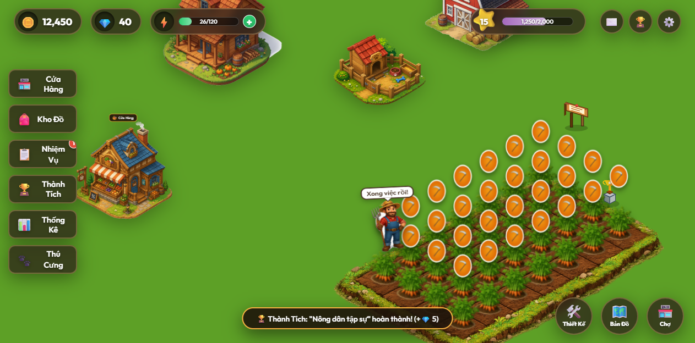

# Happy Farm

Happy Farm là một game nông trại chạy trên trình duyệt, được xây dựng bằng HTML, CSS và JavaScript module. Dự án dùng Vite để chạy môi trường phát triển/build, không có backend, và lưu tiến trình chơi trực tiếp trong `localStorage` của trình duyệt.



## Giới thiệu

Người chơi quản lý một nông trại nhỏ theo phong cách isometric: trồng cây, chờ cây lớn, thu hoạch, bán nông sản, hoàn thành nhiệm vụ và tùy chỉnh bố cục nông trại. Game có HUD tài nguyên, hệ thống năng lượng, XP/cấp độ, shop, kho đồ, nhiệm vụ, thành tích, thú cưng và các hiệu ứng tương tác trong game.

## Tính năng

- Nông trại gồm 28 ô đất với các trạng thái: trống, đang cuốc, nảy mầm, đang lớn và chín.
- Trồng và thu hoạch 4 loại cây: cà rốt, ngô, cà chua và bí ngô.
- Cửa hàng để mua hạt giống, mua phân bón và bán nông sản đã thu hoạch.
- Phân bón trung cấp giúp rút ngắn 50% thời gian còn lại; phân bón cao cấp giúp cây chín ngay.
- Hệ thống năng lượng: trồng cây tốn 3 năng lượng, thu hoạch tốn 2 năng lượng, năng lượng tự hồi theo thời gian.
- XP, cấp độ, vàng, kim cương, thống kê thời gian chơi và tổng hoạt động.
- Nhiệm vụ và thành tích có phần thưởng vàng, XP hoặc kim cương.
- Thú cưng gồm Shiba mặc định và mèo có thể mở khóa bằng kim cương.
- Nhân vật nông dân có hoạt ảnh idle, đi bộ, cuốc đất, gieo hạt và thu hoạch bằng canvas sprite.
- Gà, bò và chó di chuyển/tương tác trong nông trại.
- Chế độ thiết kế cho phép kéo thả vị trí nhà, chuồng, cửa hàng, biển tên, khu trồng và vật trang trí.
- Chế độ lót đường đất theo lưới, có thể tự nối đường giữa điểm đầu và điểm cuối.
- Zoom, pan bản đồ, hiệu ứng mây/sương, hạt bụi/tia sáng và chế độ kháng trọng lực.
- Âm thanh hiệu ứng và nhạc nền đơn giản được tạo bằng Web Audio API.

## Công nghệ sử dụng

- HTML5
- CSS3
- JavaScript ES Modules
- Canvas 2D
- Web Audio API
- LocalStorage
- Vite
- Jimp, dùng cho script xử lý/tách sprite trong `segment_sheet.js`

## Cài đặt và chạy dự án

Yêu cầu:

- Node.js `^18.0.0 || >=20.0.0`
- npm

Cài dependencies:

```bash
npm install
```

Chạy môi trường phát triển:

```bash
npm run dev
```

Build bản production:

```bash
npm run build
```

Xem thử bản build:

```bash
npm run preview
```

## Cách chơi

1. Click vào ô đất trống để mở bảng chọn hạt giống.
2. Chọn một loại hạt để trồng, hoặc dùng nút trồng tất cả để gieo hàng loạt vào các ô còn trống.
3. Chờ cây phát triển qua các giai đoạn; có thể dùng phân bón để rút ngắn thời gian.
4. Khi cây chín, click vào cây hoặc nút gặt để thu hoạch.
5. Mở cửa hàng để bán nông sản, mua thêm hạt giống hoặc phân bón.
6. Hoàn thành nhiệm vụ và thành tích để nhận thưởng.
7. Dùng chế độ thiết kế để sắp xếp lại bố cục nông trại.
8. Dùng chế độ đường đất để trang trí thêm đường đi.

## Cấu trúc dự án

```text
Happy_farm/
├── index.html          # Khung DOM chính của game, HUD, modal và popup
├── style.css           # Giao diện, layout, animation và responsive scaling
├── Game.js             # Controller chính: game loop, UI binding, gameplay, render động
├── Inventory.js        # State mặc định, lưu/tải localStorage, shop, quest, achievement
├── FarmTile.js         # Logic từng ô đất, render cây, timer và thu hoạch
├── Farmer.js           # Nhân vật nông dân, di chuyển và trạng thái hành động
├── Animation.js        # Vẽ sprite nông dân lên canvas
├── Seed.js             # Cấu hình cây trồng, thời gian lớn, giá và XP
├── Dog.js              # Thú cưng Shiba
├── Chicken.js          # Gà trong nông trại
├── Cow.js              # Bò trong nông trại
├── segment_sheet.js    # Script hỗ trợ phân tích/tách sprite bằng Jimp
├── assets/             # Ảnh nhà, chuồng, shop, farmer, cây trồng và farm grid
├── dist/               # Output sau khi build bằng Vite
└── node_modules/       # Dependencies được cài bằng npm
```

Một số ảnh `.png` ở root như `game_screenshot.png`, `shop_opened.png`, `shop_after_buy.png` và `shop_plus_twice.png` là ảnh minh họa/chụp màn hình phục vụ tài liệu hoặc kiểm tra giao diện.

## Dữ liệu lưu trữ

Game lưu tiến trình trong `localStorage` với key `happy_farm_state`. Dữ liệu bao gồm:

- Tên nông trại, vàng, kim cương, năng lượng, level và XP.
- Số lượng hạt giống, nông sản và phân bón trong kho.
- Trạng thái 28 ô đất, loại cây, thời điểm trồng và thời gian phát triển.
- Tiến độ nhiệm vụ, thành tích, thống kê chơi.
- Trạng thái thú cưng và bố cục nông trại.
- Danh sách ô đường đất đã lót.

Có thể reset dữ liệu trong modal Cài đặt của game.

## Scripts npm

| Lệnh | Mục đích |
| --- | --- |
| `npm run dev` | Chạy Vite dev server |
| `npm run build` | Build production vào `dist/` |
| `npm run preview` | Preview bản production build |

## Ghi chú phát triển

- Dự án hiện là frontend tĩnh, không có backend hoặc database riêng.
- Chưa có test suite tự động trong `package.json`.
- `dist/` là build output, không phải source chính để chỉnh sửa gameplay.
- `node_modules/` được tạo sau khi chạy `npm install`.
- Nếu thay đổi cấu hình cây trồng, chỉnh trong `Seed.js`.
- Nếu thay đổi state mặc định hoặc migration dữ liệu save, chỉnh trong `Inventory.js`.
- Nếu thay đổi luồng gameplay/UI chính, bắt đầu từ `Game.js`.
